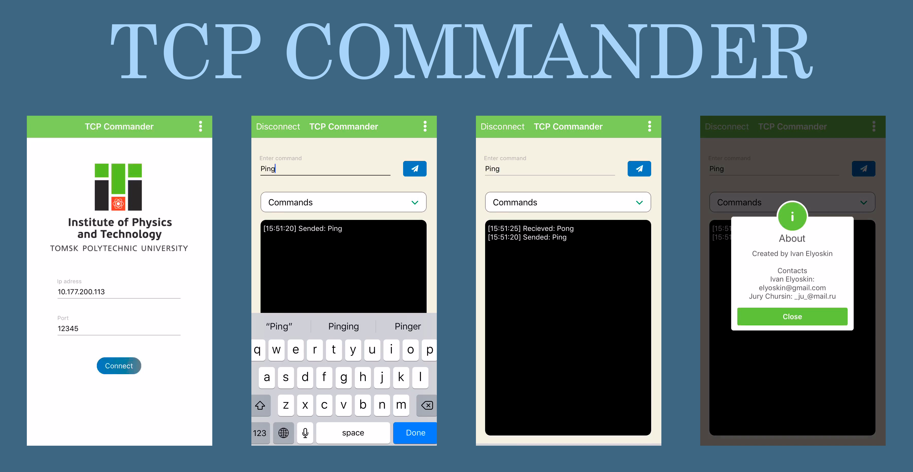

# TCP Commander

____
## Summary
TCP Commander - the application created for testing and debugging of systems that use control commands. Simulation sensors, send control commands and others.

## Features
- TCP client;
- recording and storage of custom commands; 
- storage and use of the previous connection settings;
- decrypting of incoming message;
- crlf enable/disable;
- log input format (utf-8, utf-16, HEX).

## TODO
- HEX output;
- UTF-8 output;
- CocoaPods.

## License

[MIT licensed.](LICENSE)
